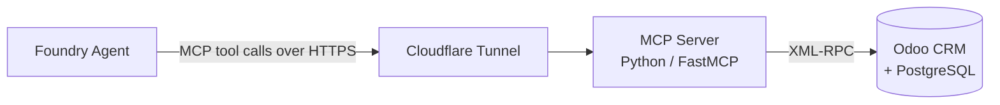

# Agentic CRM — Odoo + Microsoft Foundry

**From CRM insight to autonomous action.** A working demo showing an AI agent read live CRM data, reason across multiple signals, and take approved actions — built on a self-hosted Odoo backend and a pro-code agent on Microsoft Foundry.

---

## What this is

Most "agentic CRM" demos are either a chatbot bolted onto static screenshots, or a low-code assistant that can't explain its own reasoning. This project is neither: it's a real Odoo CRM instance, seeded with a coherent fictional dataset, exposed to a hosted Foundry agent through a custom-built MCP server — so every answer the agent gives is grounded in an actual queryable record, not a hallucinated summary.

The fictional premise: **Meridian Fleet Technologies** sells fleet telematics, cold-chain monitoring, and supply-chain SaaS/hardware to logistics, retail-distribution, and manufacturing customers. Every account, product, and support case in the demo dataset is written to be plausible within that business.

---

## Architecture



- **Odoo CRM** — the business system of record. Self-hosted Community Edition via Docker, chosen deliberately over SaaS trials to keep unrestricted External API access.
- **MCP server** — a Python service that translates [Model Context Protocol](https://modelcontextprotocol.io) tool calls into Odoo XML-RPC calls, and back into readable results. Runs on Streamable HTTP so a hosted agent can call it directly.
- **Cloudflare Tunnel** — exposes the local MCP server over a public HTTPS URL without opening any inbound ports.
- **Microsoft Foundry Agent Service** — hosts the actual agent: grounds responses in CRM context, calls the MCP tools, and enforces human approval before any write action.

---

## Tech stack

| Layer | Technology |
|---|---|
| CRM backend | Odoo 19 Community, PostgreSQL 16, Docker Compose |
| Data/tool layer | Custom MCP server (Python, FastMCP SDK) over Odoo's XML-RPC API |
| Tunneling | Cloudflare Tunnel (`cloudflared`) |
| Agent layer | Microsoft Foundry Agent Service — hosted agent |
| Cases model | Odoo Project app (Community-compatible substitute for the Enterprise-only Helpdesk app) |

---

## Agent scenarios

| Scenario | Question it answers | Key tool(s) |
|---|---|---|
| **Sales Pipeline Agent** | "Which deals are likely to slip this month?" | `find_stalled_opportunities`, `create_followup_task` |
| **Customer Risk Agent** | "Which customers need attention today? Why?" | `list_accounts_needing_attention`, `explain_account_risk`, `escalate_case` |
| **Meeting Prep Agent** | "Prepare me for my call with this account." | `prepare_meeting_brief` |
| **Executive Reporting Agent** | "Give me this week's customer and pipeline health." | `get_weekly_executive_summary` |

Two tools (`create_followup_task`, `escalate_case`) write to Odoo. Every other tool is read-only. Write actions are designed to be gated behind explicit human approval in the agent's instructions — the agent explains and recommends first, and only acts once approved.

---

## Repository structure

```
.
├── docker-compose.yml               # Odoo + PostgreSQL services
├── addons/                          # Odoo custom addons mount point
├── seed_demo_data.py                # Seeds Odoo with the demo dataset
├── odoo_mcp_foundry_connector.py    # MCP server exposing 7 tools over XML-RPC (the one Foundry connects to)
├── testing-connection.py            # Standalone XML-RPC auth sanity check
├── .env.example                     # Template for required environment variables — copy to .env, never commit .env
├── .gitignore
├── pyproject.toml / uv.lock         # Python dependency management (uv)
├── .python-version
├── command.md                       # Command reference
├── restore_database.md              # Snapshot/restore instructions
├── Tunnel-cheat-sheet.md            # Full command-by-command tunnel reference
└── README.md
```

> **Note:** this repo previously carried two other MCP server drafts (`mcp-server.py`, `odoo-mcp-server.py`) from earlier iterations. Only `odoo_mcp_foundry_connector.py` is live — the other two should be deleted before this goes public, since leftover near-duplicate files read as unfinished work to anyone reviewing the repo. `backup.dump` and `hero_reference.json` are environment-specific/generated output and should not be tracked in git — see **Security** below.

---

## Getting started

Three processes need to run at once: Odoo, the MCP server, and a tunnel.

### 1. Start Odoo

```bash
docker compose up -d
```

Then install the CRM, Contacts, Project, and Sales apps from the Odoo Apps screen.

### 2. Seed the demo data

```bash
python seed_demo_data.py
```

Creates 20 products, 6 hand-crafted "hero" accounts (each engineered to demonstrate one scenario above), and ~44 additional accounts with contacts, opportunities, activities, and cases. Record IDs for the hero accounts are saved to `hero_reference.json`.

### 3. Run the MCP server

```bash
export ODOO_URL="http://localhost:8069"
export ODOO_DB="your-db-name"
export ODOO_USERNAME="agent@demo.local"
export ODOO_PASSWORD="your-agent-password"
export MCP_HOST="0.0.0.0"
export MCP_PORT="8000"

uv run python odoo_mcp_foundry_connector.py --http
```

Use a dedicated least-privilege Odoo user for `ODOO_USERNAME` — not the admin account.

### 4. Expose it and connect Foundry

```bash
cloudflared tunnel --url http://localhost:8000
```

Register the printed URL (with `/mcp` appended) as an MCP Toolbox in your Foundry project.

For a full command-by-command reference, see [`Tunnel-cheat-sheet.md`](Tunnel-cheat-sheet.md). For database snapshot/restore, see [`restore_database.md`](restore_database.md).

---

## Demo flow

1. Open the Odoo CRM dashboard — signals come from a real business app.
2. Ask the agent: *"Which accounts need attention today?"* — retrieval and prioritization over live records.
3. Ask: *"Why is this account risky?"* — multi-factor reasoning across opportunities, cases, and activity history.
4. Ask: *"Draft a follow-up email."* — content generation grounded in account context.
5. Approve task creation — human-in-the-loop write action.
6. Trigger an escalation — event-driven automation path.

---

## Security

This repo previously had real credentials exposed in tracked files — if you're forking or referencing this project, note the pattern below rather than the mistake:

- **Never commit `.env`.** All credentials are read from environment variables (`ODOO_URL`, `ODOO_DB`, `ODOO_USERNAME`, `ODOO_PASSWORD`) — see `.env.example` for the required keys. Both scripts refuse to run with a clear error if required variables are missing, rather than falling back to a hardcoded default.
- **`hero_reference.json` and `backup.dump` are environment-specific generated output**, not source code — they're gitignored and should never be tracked. If either is currently committed in your history, remove them with `git rm --cached hero_reference.json backup.dump` and commit that removal.
- **If credentials were ever committed and pushed** (even briefly, even in an old commit), rotate them immediately in Odoo — deleting the file afterward does not remove it from git history. Scrubbing history (`git filter-repo` or the BFG Repo-Cleaner) is the correct fix if the repo needs to stay public and keep its commit history; for a solo demo repo, deleting and recreating it clean is often simpler.
- **Least privilege**: the MCP server authenticates as a scoped demo Odoo user (`agent@demo.local` in this project), not admin — see `Odoo_Setup_and_Demo_Data_Guide` for how that user was created with restricted access rights.
- **Fictional data only** — no real customer or personal information anywhere in the dataset.
- **Read/write separation** — 5 of the 7 MCP tools are strictly read-only; the two write tools (`create_followup_task`, `escalate_case`) are designed to sit behind explicit human approval in the agent's instructions, not to be called freely.

---

## Status

| Phase | Status |
|---|---|
| Odoo CRM foundation + demo data | ✅ Complete |
| MCP server + tunnel exposure | ✅ Complete |
| Foundry agent creation | ✅ Complete |
| Automation (scheduled runs, notifications) | ⬜ Planned |
| Observability & demo polish | ⬜ Planned |

---

## License

This is a demo/portfolio project using entirely fictional data. Not affiliated with or endorsed by Odoo S.A. or Microsoft.